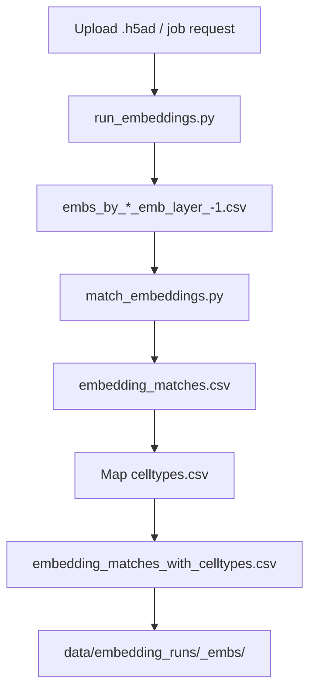

# Brain Tumor Annotation Portal (BAT Portal)

The Brain Tumor Annotation Portal (BAT Portal) is a web platform and API for
annotating glioma single-cell RNA-seq data with Geneformer-derived embeddings,
FAISS similarity search, and Scanpy-based visualization. It includes a
conversational chat interface, background embedding pipelines, and optional
Firestore-backed features (auth + supplemental tables).

## What it does

- **Annotation API**: Upload `.h5ad` data and receive per-cell annotations with
  top matches and confidence scores.
- **Embedding pipeline**: Run Geneformer layer `-1` embeddings + matching +
  cell-type mapping as a background job.
- **Visualization API**: UMAP, Leiden clustering, differential expression, and
  ligand/receptor/drug target overlays.
- **Chat agent UI**: Natural language interaction with file upload and optional
  Gemini/Vertex-powered responses.
- **Auth endpoints**: Firestore-backed signup/signin for future UI flows.

## Repository layout

```
├── backend/                  FastAPI backend + services
│   ├── api/                  API endpoints
│   ├── services/             Annotation, chat agent, pipelines, Firestore
│   ├── run_embeddings.py     Geneformer embedding extraction
│   ├── match_embeddings.py   Cosine similarity matching utility
│   └── HOWTO_EMBEDDINGS.md   Embedding extraction guide
├── data/                     Reference data + generated outputs
├── frontend/                 Static HTML UI (index + chat)
├── frontend-react/           Optional Vite/React UI
├── Geneformer/               Local Geneformer checkout (for embeddings)
├── preps/                    Offline prep scripts + notebooks
├── scripts/                  Offline utilities
├── METHODOLOGY_AND_DISCUSSION.md
├── PROJECT_SUMMARY.md
├── SETUP.md
└── requirements.txt
```

## Core data paths (from `backend/config.py`)

These are the canonical paths the backend expects inside this repo:

- `data/adata.h5ad` (reference AnnData for indexing)
- `data/embeddings/` (reference embedding files or CSVs)
- `data/embeddings/embedding_coordinates.csv` (optional fallback embeddings)
- `data/reference_embeddings.faiss` (FAISS index)
- `data/reference_cell_ids.pkl` (reference cell ID mapping)
- `data/reference_annotations.pkl` (reference annotations)
- `data/annotations/celltypes.csv` (cell type mapping for pipeline outputs)
- `backend/dict/` (Geneformer dictionaries)
- `backend/dirks_primary_gbm_combined_2000perCellType/` (fine-tuned model)

Visualization-specific annotation data:

- `data/annotations/ligands.txt`
- `data/annotations/receptors.txt`
- `data/annotations/drug.tsv`

## Quick start

**Python requirement:** 3.10 or 3.11 (Geneformer is not stable on 3.12+).

### Windows (PowerShell)

```powershell
py -3.11 -m venv venv
.\venv\Scripts\Activate.ps1
pip install -r requirements.txt
python scripts\prepare_reference_embeddings.py
uvicorn backend.main:app --host 0.0.0.0 --port 8000 --reload
```

In a new terminal:

```powershell
cd frontend
python -m http.server 8080
```

Open:
- http://localhost:8080
- http://localhost:8000/docs
- http://localhost:8080/chat.html

### macOS/Linux

```bash
python3 -m venv venv
source venv/bin/activate
pip install -r requirements.txt
python scripts/prepare_reference_embeddings.py
uvicorn backend.main:app --host 0.0.0.0 --port 8000 --reload
```

In a new terminal:

```bash
cd frontend
python3 -m http.server 8080
```

### Optional React UI

```bash
cd frontend-react
npm install
npm run dev
```

## Embedding extraction (Geneformer)

The background embedding pipeline uses Geneformer + the dictionaries and
fine-tuned model bundled in `backend/`. For detailed steps, see
`backend/HOWTO_EMBEDDINGS.md`.

Minimal run (offline):

```bash
python backend/run_embeddings.py \
  --h5ad /path/to/input.h5ad \
  --dict-dir backend/dict \
  --models-root backend \
  --gene-id-type symbol
```

## API endpoints (FastAPI)

Core:
- `GET /api/health`
- `POST /api/annotate` (multipart form: `file`, `top_k`, `similarity_threshold`)
- `GET /api/annotate/status`
- `POST /api/visualize` (multipart form: `file` + optional params)

Chat:
- `POST /api/chat/session`
- `GET /api/chat/session/{session_id}`
- `POST /api/chat/{session_id}/message` (multipart form: `message`, optional `file`)
- `POST /api/chat/{session_id}/annotate`
- `DELETE /api/chat/session/{session_id}`

Embeddings:
- `POST /api/embeddings/jobs` (run `run_embeddings.py` only)
- `GET /api/embeddings/jobs/{job_id}`
- `GET /api/embeddings/jobs/{job_id}/log`
- `POST /api/embeddings/pipeline/jobs` (run + match + map cell types)
- `GET /api/embeddings/pipeline/jobs/{job_id}`
- `GET /api/embeddings/pipeline/jobs/{job_id}/log`

Auth:
- `POST /api/auth/signup`
- `POST /api/auth/signin`

## Pipelines and data flow

### Annotation (`/api/annotate`)

- Upload `.h5ad` → embeddings computed (or loaded) → FAISS similarity search →
  JSON response with per-cell predictions and top matches.
- The endpoint also triggers a **background embedding pipeline job**; the job
  status and output paths are returned in `metadata.embedding_pipeline_job`.

### Embedding pipeline (`/api/embeddings/pipeline/jobs`)



### Visualization (`/api/visualize`)

```mermaid
flowchart TD
  A[Upload .h5ad] --> B[Scanpy preprocess]
  B --> C[UMAP + Leiden]
  C --> D[Supptable cell types (optional)]
  D --> E[DE genes + ligand/receptor/drug overlaps]
  E --> F[JSON response + analysis summary]
```

## Files written to disk

- `data/uploads/` (temporary uploads for `/api/annotate`)
- `data/embedding_jobs/*.log` (embedding job logs)
- `data/embedding_runs/<h5ad_stem>_embs/`
  - `embs_by_*_emb_layer_-1.csv`
  - `embedding_matches.csv`
  - `embedding_matches_with_celltypes.csv`
- `data/analysis_runs/visualization_summary_*.json` (visualization summaries)
- `data/SuppTable1.xlsx` (cached marker-weight table if pulled from GCS)

`/api/visualize` and `/api/annotate` return JSON responses; the only persistent
outputs are the logs and pipeline artifacts above.

## Configuration (environment variables)

Core:
- `HOST`, `PORT` (default `0.0.0.0:8000`)

Gemini / Vertex AI (optional, for chat agent):
- `GEMINI_API_KEY`
- `GEMINI_MODEL` (default: `gemini-1.5-flash`)
- `VERTEX_PROJECT_ID`
- `VERTEX_LOCATION` (default: `us-central1`)
- `GOOGLE_APPLICATION_CREDENTIALS` (service account JSON)

Firestore (optional, for auth + supptable lookup):
- `FIRESTORE_PROJECT_ID`
- `FIRESTORE_COLLECTION` (default: `users`)
- `FIRESTORE_DATABASE_ID` (optional)
- `FIRESTORE_SUPPTABLE_COLLECTION` (default: `supptables`)
- `SUPPTABLE_DOC_ID` / `SUPPTABLE_URL` (supptable source)

Marker-weight lookup (chat agent):
- `MARKER_WEIGHTS_GCS_URI` (e.g., `gs://bucket/path/to/SuppTable1.xlsx`)
- `MARKER_WEIGHTS_SHEET` (worksheet name; defaults to active sheet)

## UI entry points

- Static UI: `frontend/index.html`
- Chat UI: `frontend/chat.html`
- React UI (optional): `frontend-react/`

## Troubleshooting

### FAISS index missing
Run:
```bash
python scripts/prepare_reference_embeddings.py
```

### Embedding extraction fails
- Ensure `.h5ad` has valid gene identifiers and counts.
- For gene symbols in `adata.var_names`, run with `--gene-id-type symbol`.
- Geneformer dependencies are **not** installed via `requirements.txt`; see
  `backend/HOWTO_EMBEDDINGS.md`.

### Visualization errors
- Leiden clustering requires `leidenalg` and `python-igraph`.
- Supptable/annotation errors usually mean missing `data/annotations/*` files.

### Ports already in use
- Change `PORT` for the backend or use a different port for the static frontend.

## Additional docs

- `SETUP.md` (step-by-step setup guide)
- `CHAT_AGENT.md` (chat interface usage)
- `backend/HOWTO_EMBEDDINGS.md` (embedding extraction guide)
- `METHODOLOGY_AND_DISCUSSION.md` (project methodology + discussion)
