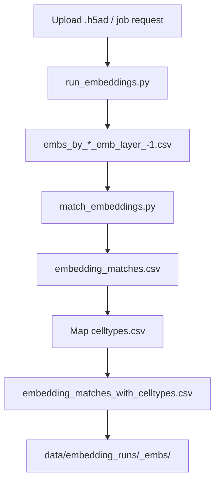

# Brain Tumor Annotation Portal (BAT Portal)

The Brain Tumor Annotation Portal (BAT Portal) is a web platform and API for
annotating glioma single-cell RNA-seq data with Geneformer-derived embeddings,
FAISS similarity search, and Scanpy-based visualization. The main user-facing
experience is the **NeuroAnnotate** React portal (`frontend-react/`): landing
page, sign-in, analysis dashboard (annotation + visualization), optional
assistant chat, and profile. The FastAPI backend powers uploads, jobs, chat,
and auth.

## Web portal (NeuroAnnotate)

The React app (Vite + Tailwind) talks to the API at **`http://localhost:8000`**
(see `frontend-react/src/components/PortalPage.jsx` and `AuthModal.jsx`). CORS
allows `localhost` / `127.0.0.1` on common dev ports (for example `5173`, `8080`).

### Routes (hash-based)

| URL hash | Page | Who can open it |
|----------|------|-----------------|
| *(empty)* | Landing | Anyone |
| `#/portal` | Analysis dashboard | Signed-in users only |
| `#/chat` | Full-page chat | Signed-in users only |
| `#/profile` | Profile | Signed-in users only |

After a successful sign-in, the app navigates to `#/portal`.

### Landing (`LandingPage`)

Marketing-style landing with **Get started**, which opens the auth modal.

### Sign in / sign up (`AuthModal`)

- **Sign in** calls `POST /api/auth/signin` with email and password.
- **Sign up** calls `POST /api/auth/signup` (Firestore-backed; requires a
  working Firestore setup—see [Configuration](#configuration-environment-variables)).

**Development sign-in:** Firestore-backed sign-in is currently bypassed in
`backend/api/auth.py`. Valid demo credentials are defined there as
`DEMO_EMAIL` and `DEMO_PASSWORD`. Replace or remove this bypass before any
production use.

### Analysis dashboard (`PortalPage`)

Single **Upload** area for `.h5ad` files (drag-and-drop or browse). Two main
tabs:

1. **Annotation**
   - Parameters: **Top K** neighbors, **similarity threshold**.
   - Runs **`POST /api/annotate`**; shows per-cell predictions, confidence,
     stats, and embedding-pipeline / match status when returned by the API.
   - Views for predictions vs embedding matches; export of embedding match
     tables (CSV via client-side generation).
   - Backend health is checked with **`GET /api/health`**; warnings appear if
     reference data or the FAISS index is not ready.

2. **Visualization**
   - Scanpy-style analysis via **`POST /api/visualize`** with tunable options
     (e.g. cluster resolution, DE top *N*, coloring by cluster vs cell type,
     supptable URL, differential expression filters and sorting).
   - Displays UMAP-style outputs and summaries when the API returns them;
     analysis summaries may be exposed under `/analysis_runs/` on the backend.

**Assistant chat (large screens):** A floating action button opens an **embedded**
chat panel (right side on `lg+` breakpoints) using the same **`ChatPage`**
component as the full `#/chat` route. It uses the chat API (`/api/chat/...`)
and can receive context such as the visualization analysis summary path when
available.

### Full-page chat (`ChatPage`)

Dedicated conversational UI: session creation, messages, optional **`.h5ad`**
upload with annotate flow, backed by **`/api/chat/...`**. Optional Gemini /
Vertex behavior depends on backend env vars.

### Profile (`ProfilePage`)

Editable **research profile** fields (name, email, institution, lab, ORCID,
etc.). Values are **local to the browser session** (not persisted to the
backend unless you extend the API).

### Header

Branding (**NeuroAnnotate**), **Sign in** when logged out, and when logged in a
menu with **Profile**, **Settings** (placeholder), and **Sign out**.

---

## What the full stack does

- **Annotation API**: Upload `.h5ad` data and receive per-cell annotations with
  top matches and confidence scores.
- **Embedding pipeline**: Geneformer layer `-1` embeddings + matching + cell-type
  mapping as a background job.
- **Visualization API**: UMAP, Leiden clustering, differential expression, and
  ligand/receptor/drug target overlays.
- **Chat agent**: Natural language interaction with file upload and optional
  Gemini/Vertex-powered responses.
- **Auth API**: Sign-up uses Firestore; sign-in behavior is defined in
  `backend/api/auth.py` (see above).

## Repository layout

```
├── backend/                     FastAPI app + services
│   ├── api/                     REST routers (annotate, chat, auth, visualize, embeddings, health)
│   ├── services/                Annotation, chat, visualization, Firestore, pipelines
│   ├── main.py                  App entry + CORS + static mount for analysis_runs
│   ├── config.py                Paths and environment settings
│   ├── run_embeddings.py        Geneformer embedding extraction (wrapper)
│   ├── match_embeddings.py      Cosine similarity matching utility
│   └── HOWTO_EMBEDDINGS.md      Embedding extraction notes
├── CODE_FOR_PREDICTING_CELL_TYPE/   Default dict + fine-tuned model roots (see config env vars)
├── data/                        Reference data + generated outputs
├── frontend/                    Legacy static HTML UI (index + chat)
├── frontend-react/              NeuroAnnotate — Vite + React + Tailwind (primary UI)
├── preps/                       Offline prep scripts + notebooks
├── scripts/                     Utilities (e.g. prepare_reference_embeddings.py)
├── requirements.txt             Python dependencies for the API
├── SETUP.md                     Step-by-step setup
├── CHAT_AGENT.md                Chat interface / agent notes
├── METHODOLOGY_AND_DISCUSSION.md
└── PROJECT_SUMMARY.md
```

## Core data paths (from `backend/config.py`)

Canonical paths the backend expects (defaults use `CODE_FOR_PREDICTING_CELL_TYPE`
for embedding dict/model roots unless overridden by env):

- `data/adata.h5ad` — reference AnnData for indexing
- `data/embeddings/` — reference embedding files or CSVs
- `data/embeddings/embedding_coordinates.csv` — optional fallback embeddings
- `data/reference_embeddings.faiss` — FAISS index
- `data/reference_cell_ids.pkl` — reference cell ID mapping
- `data/reference_annotations.pkl` — reference annotations
- `data/annotations/celltypes.csv` — cell type mapping for pipeline outputs

Visualization annotation files:

- `data/annotations/ligands.txt`
- `data/annotations/receptors.txt`
- `data/annotations/drug.tsv`

Override embedding locations with `EMBEDDING_DICT_DIR`, `EMBEDDING_MODELS_ROOT`,
and `EMBEDDING_FINETUNE_SUBDIR` if your tree differs.

## Quick start (recommended: React portal + API)

**Python:** 3.10 or 3.11 (Geneformer / scientific stack is not stable on 3.12+  
for embedding jobs).

**Node.js:** 18+ (for Vite 5).

### 1. Backend (terminal 1)

**Windows (PowerShell)** — from the repository root:

```powershell
py -3.11 -m venv venv
.\venv\Scripts\Activate.ps1
pip install -r requirements.txt
python scripts\prepare_reference_embeddings.py
uvicorn backend.main:app --host 0.0.0.0 --port 8000 --reload
```

**macOS / Linux:**

```bash
python3.11 -m venv venv
source venv/bin/activate
pip install -r requirements.txt
python scripts/prepare_reference_embeddings.py
uvicorn backend.main:app --host 0.0.0.0 --port 8000 --reload
```

- API docs: [http://localhost:8000/docs](http://localhost:8000/docs)
- Health: [http://localhost:8000/api/health](http://localhost:8000/api/health)

### 2. NeuroAnnotate frontend (terminal 2)

```bash
cd frontend-react
npm install
npm run dev
```

Open **[http://localhost:5173](http://localhost:5173)** (Vite default). Sign in
using the demo credentials in `backend/api/auth.py`, then use **Analysis
Dashboard** (`#/portal`).

**Optional:** set `VITE_API_BASE_URL` in `frontend-react/.env` if the API is not
on `http://127.0.0.1:8000`. Note: some components still use a fixed API base
for fetches; keep the backend on port **8000** unless you align those URLs.

### 3. Production-style frontend build

```bash
cd frontend-react
npm install
npm run build
npm run preview   # optional: test the production build locally
```

Serve the `frontend-react/dist` folder with any static host; ensure that host’s
origin is allowed by CORS in `backend/main.py` or adjust `allow_origins` /
`allow_origin_regex` there.

## Alternative: static frontend only

Legacy UI without the React portal:

**Windows:**

```powershell
cd frontend
python -m http.server 8080
```

**macOS / Linux:**

```bash
cd frontend
python3 -m http.server 8080
```

- [http://localhost:8080](http://localhost:8080) — `index.html`
- [http://localhost:8080/chat.html](http://localhost:8080/chat.html) — chat page

## Embedding extraction (Geneformer)

The embedding pipeline uses Geneformer plus dictionaries and fine-tuned weights
under `CODE_FOR_PREDICTING_CELL_TYPE/` by default. See `backend/HOWTO_EMBEDDINGS.md`
and `CODE_FOR_PREDICTING_CELL_TYPE/HOWTO_EMBEDDINGS.md` for details.

Minimal invocation (use `--dict-dir` and `--models-root` that match your
machine; defaults align with `EMBEDDING_DICT_DIR` / `EMBEDDING_MODELS_ROOT` in
`backend/config.py`):

```bash
python backend/run_embeddings.py \
  --h5ad /path/to/input.h5ad \
  --dict-dir /path/to/geneformer/dict \
  --models-root /path/to/finetuned/model/root \
  --gene-id-type symbol
```

Geneformer-specific dependencies are **not** all pulled in by `requirements.txt`;
follow the HOWTO for the full environment.

## API endpoints (FastAPI)

Core:

- `GET /api/health`
- `POST /api/annotate` (multipart: `file`, `top_k`, `similarity_threshold`)
- `GET /api/annotate/status`
- `POST /api/visualize` (multipart: `file` + optional params)

Chat:

- `POST /api/chat/session`
- `GET /api/chat/session/{session_id}`
- `POST /api/chat/{session_id}/message` (multipart: `message`, optional `file`)
- `POST /api/chat/{session_id}/annotate`
- `DELETE /api/chat/session/{session_id}`

Embeddings:

- `POST /api/embeddings/jobs`
- `GET /api/embeddings/jobs/{job_id}`
- `GET /api/embeddings/jobs/{job_id}/log`
- `POST /api/embeddings/pipeline/jobs`
- `GET /api/embeddings/pipeline/jobs/{job_id}`
- `GET /api/embeddings/pipeline/jobs/{job_id}/log`

Auth:

- `POST /api/auth/signup` (Firestore)
- `POST /api/auth/signin` (see [Sign in / sign up](#sign-in--sign-up-authmodal))

Static files:

- `GET /analysis_runs/...` — served from `data/analysis_runs/` (visualization outputs)

## Pipelines and data flow

### Annotation (`/api/annotate`)

- Upload `.h5ad` → embeddings computed (or loaded) → FAISS similarity search →
  JSON with per-cell predictions and top matches.
- May trigger a **background embedding pipeline job**; status and paths can
  appear in `metadata.embedding_pipeline_job`.

### Embedding pipeline (`/api/embeddings/pipeline/jobs`)



### Visualization (`/api/visualize`)

```mermaid
flowchart TD
  A[Upload .h5ad] --> B[Scanpy preprocess]
  B --> C[UMAP + Leiden]
  C --> D[Supptable cell types (optional)]
  D --> E[DE genes + ligand/receptor/drug overlaps]
  E --> F[JSON response + analysis summary]
```

## Files written to disk

- `data/uploads/` — temporary uploads for `/api/annotate`
- `data/embedding_jobs/*.log` — embedding job logs
- `data/embedding_runs/<h5ad_stem>_embs/`
  - `embs_by_*_emb_layer_-1.csv`
  - `embedding_matches.csv`
  - `embedding_matches_with_celltypes.csv`
- `data/analysis_runs/visualization_summary_*.json`
- `data/SuppTable1.xlsx` — cached marker-weight table if pulled from GCS

`/api/visualize` and `/api/annotate` return JSON; persistent artifacts are mainly
logs and pipeline outputs above.

## Configuration (environment variables)

Optional `.env` at the **repository root** is loaded by `backend/config.py`.

Core:

- `HOST`, `PORT` — defaults `0.0.0.0:8000` (uvicorn CLI still chooses the port you pass)

Embedding paths (optional overrides):

- `EMBEDDING_DICT_DIR`
- `EMBEDDING_MODELS_ROOT`
- `EMBEDDING_FINETUNE_SUBDIR`
- `EMBEDDING_GENE_ID_TYPE`

Gemini / Vertex AI (optional, for chat):

- `GEMINI_API_KEY`
- `GEMINI_MODEL` (default: `gemini-1.5-flash`)
- `VERTEX_PROJECT_ID`
- `VERTEX_LOCATION` (default: `us-central1`)
- `GOOGLE_APPLICATION_CREDENTIALS` — service account JSON path  
  (if unset, `backend/credentials/*.json` may be picked up automatically when present)

Firestore (signup + optional supptable lookup):

- `FIRESTORE_PROJECT_ID`
- `FIRESTORE_COLLECTION` (default: `users`)
- `FIRESTORE_DATABASE_ID` (optional)
- `FIRESTORE_SUPPTABLE_COLLECTION` (default: `supptables`)
- `SUPPTABLE_DOC_ID` / `SUPPTABLE_URL`

Marker-weight lookup (chat agent):

- `MARKER_WEIGHTS_GCS_URI`
- `MARKER_WEIGHTS_SHEET`

## Troubleshooting

### FAISS index or reference data missing

```bash
python scripts/prepare_reference_embeddings.py
```

### Backend unreachable from the portal

- Ensure uvicorn is listening on **port 8000** (or update frontend API URLs to match).
- Check browser devtools for CORS errors; add your dev origin in `backend/main.py` if needed.

### Embedding extraction fails

- Ensure `.h5ad` has valid gene identifiers and counts.
- For gene symbols in `adata.var_names`, use `--gene-id-type symbol`.
- Install Geneformer / torch stack per `HOWTO_EMBEDDINGS.md`.

### Visualization errors

- Leiden clustering needs `leidenalg` and `python-igraph` (included in `requirements.txt`).
- Missing `data/annotations/*` files cause annotation overlay issues.

### Sign up fails with Firestore errors

- Configure `GOOGLE_APPLICATION_CREDENTIALS` and Firestore env vars, or use
  **sign-in** only with the dev bypass credentials in `backend/api/auth.py`.

### Ports in use

- Use another port for uvicorn:  
  `uvicorn backend.main:app --host 0.0.0.0 --port 8001 --reload`  
  and point the React app at that base URL.

## Additional docs

- `SETUP.md` — step-by-step setup
- `CHAT_AGENT.md` — chat interface usage
- `backend/HOWTO_EMBEDDINGS.md` — embedding extraction
- `METHODOLOGY_AND_DISCUSSION.md` — methodology and discussion
